# Tic Tac Toe

Tic Tac Toe game website is classic fun meets modern convenience! This project aims to provide an engaging and accessible gaming experience for players of all ages. With its straightforward rules and quick matches, it's an ideal choice for casual gamers, families, and friends looking to challenge each other to a friendly competition.

Tic-tac-toe is a classic two-player game where players take turns marking spaces in a 3x3 grid with their respective symbols, aiming to be the first to form a horizontal, vertical, or diagonal line.

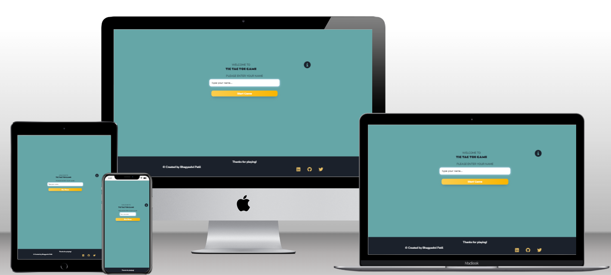

The live link can be found by clicking [here](https://bhagyashriyogeshpatil.github.io/TicTacToe/).

- - -
## Features 
### Existing Features
- __Favicon__
    - The favicon on our Tic Tac Toe game website looks like a small Tic Tac Toe board, making it easy to recognize and nice to look at. It helps people know it's our website and reminds them of the game they're about to play. It's small so it fits nicely in the tabs of your web browser and makes the website feel complete.

###### Favicon

- __Login Screen__
	- In this section, users can type in their name to begin playing the game. The game won't start unless the user enters their name. If the user tries to start the game without entering their name, an error message will appear.
	- You can begin the game by clicking the "Start Game" button. Additionally, there's an information (i) icon available for viewing the game's instructions and rules.
    
###### Login Screen for Mobile
 

###### Login Screen for Desktop

###### User Login Error Message

- __Instruction Modal__
	- This section provides instructions and rules on how to play the game. If the user clicks on the "i" icon, a modal with instructions will appear. There is a close button to close this instruction modal. 
	- Instruction modal is available while playing the game.

###### Instruction Modal for Mobile

###### Instruction Modal for Desktop

- __Game Screen__
	- In this section, users can engage in the game, which features a 3x3 grid. The game involves two players, marked as X and O, taking turns. Additionally, users will find their username and user icon displayed in the top left corner.
	- User will find a "Reset Game" button that allows user to begin the new game.

###### Game Screen for Mobile

###### Game Screen for Desktop

- __Winner Message__
	- In this section, once the game is completed a message will be shown indicating the winner or declaring a draw.

###### Winner Message for Mobile

###### Winner Message for Desktop

- __Footer__
    - Within this section, users can access social media links and find copyright information.

###### Footer for Mobile

###### Footer for Desktop

### Features Left to Implements
- Implement a "Play Against Computer" feature.
- Adding difficulty levels feature.

- - -
## User Experience (UX)
### User Stories

#### **First Time Visitor Goals**
- **Learn the Game Easily:** Provide clear instructions on how to play tic-tac-toe and make the game interface easy to understand.
- **Device Responsiveness:** Design the game interface to work seamlessly across different devices, including desktops, tablets, and smartphones.
- **Intuitive Navigation:** Keep the interface clean and user-friendly, with easily accessible buttons for starting a game and accessing settings

#### **Returning Visitor Goals**
- **Keep it Simple:** Make sure returning players find the game just as easy to play as the first time.

#### **Frequent Visitor Goals:**
- **Keep it Fun:** Add new challenges to keep players interested and coming back for more.

- - -
## Design

## Wireframe
- The wireframe for the mobile version of the website was created using Figma. While the implemented version may not match the exact layout of the wireframe due to changes made during development, the initial design provided valuable insights and a starting point for the development process.

###### Login Screen Wireframe
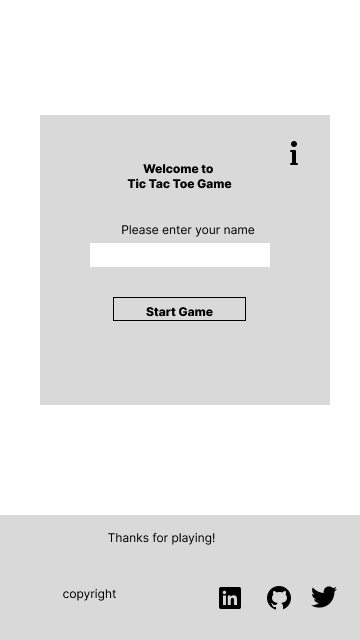

###### Instruction Modal Wireframe
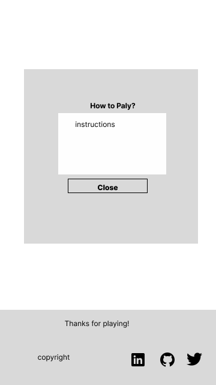

###### Game Screen Wireframe
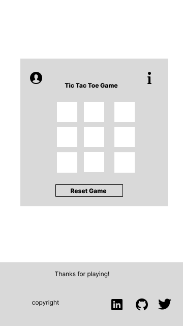

###### Winner Message Wireframe
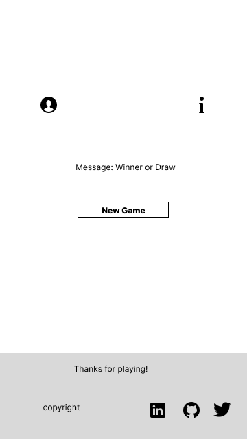

### Colour Scheme
The color scheme is created using [Coolors](https://coolors.co/). I've utilized #65A6A7 for the body background, #FCCD4D for buttons, #FFFFC7 for game board boxes, #CF2857 for instructional modals, and #C9A7B0 for user login error messages.

### Typography

Google Fonts was used to import the chosen fonts for use in the site.
* For the body of the website, I've utilized the Google font [Nunito](https://fonts.google.com/specimen/Nunito?query=Nunito).
* For the Game Title, I've utilized the Google font [Rammetto](https://fonts.google.com/specimen/Rammetto+One?query=Rammetto).

- - -
## Testing 

### Code Validation 

- **Html Validation**
    - No errors were returned when passing through the official [W3C validator](https://validator.w3.org/)

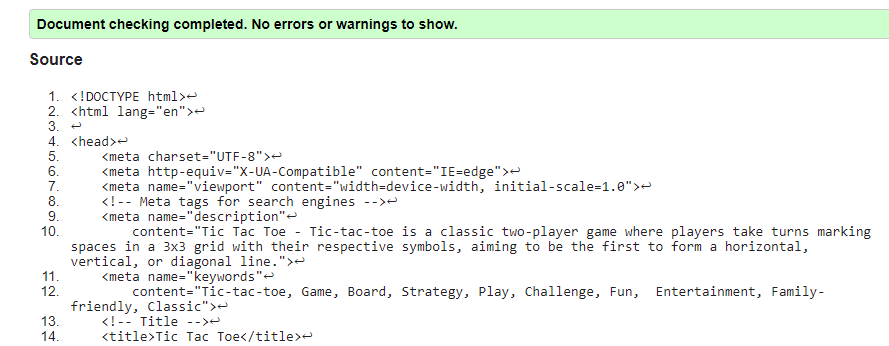

- **CSS Validation**
    - No errors were found when passing through the official [(Jigsaw) validator](https://jigsaw.w3.org/css-validator/)

- **JavaScript Validation**
    -  No errors were found when passing through the official Jshint validator
[Jshint validator](https://jshint.com/)
	- The following metrics were returned: 
	  - There are 14 functions in this file.
	  - Function with the largest signature take 1 arguments, while the median is 0.
	  - Largest function has 10 statements in it, while the median is 4.
	  - The most complex function has a cyclomatic complexity value of 7 while the median is 1.

### Lighthouse Report

###### Lighthouse Report for Mobile
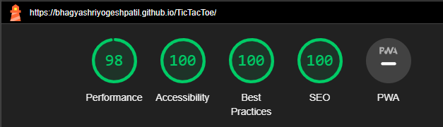

###### Lighthouse Report for Desktop
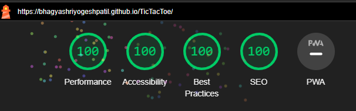

### Solved Bugs

| No | Bug | How I solved the issue |
| :--- | :--- | :--- |
| 1 |An error was displaying in the console, when the HTML file was created.  | Upon including `<link rel="shortcut icon" href="#">` in the <head> element of the HTML file, the error was resolved.|
| 2 |While validating with JShint, I encountered some warnings related to the usage of the 'let' variable.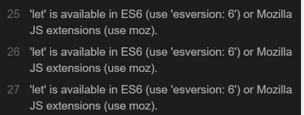| The warnings were resolved after inserting `/* jshint esversion: 6 */` into the script.js file.I referred to [this solution](https://stackoverflow.com/questions/61764048/i-cant-fix-the-let-warning-in-jshint-plugin-for-vscode-in-all-the-new-project) for resolution.|
| 3 |During JShint validation, an unused variable was detected. 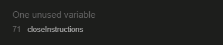 The cause of this issue is that I applied the onclick attribute to the close button in the HTML file.|To resolve this problem, I removed the onclick attribute from the close button in the HTML file. Additionally, I added an event listener to the close button in the JavaScript file.|
| 4 |During JShint validation, a warning is issued for functions declared within loops. 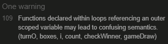| I adjusted the code to resolve the warning related to outer scoped variables. `createClickListener` function is used to create a click event listener for each box. I looked at a [Stack Overflow post](https://stackoverflow.com/questions/55894175/javascript-code-raising-warning-in-jshint-com-functions-declared-within-loops-r) to fix the warning.|

### Manual Testing
| Feature | Expected Outcome | Testing Performed | Result      |
|:--------|:----------------|:-------------------|:-------------|
| User Login| - Prompt for username input upon page load.| Loaded the page.| Pass|
|   | - User can enter a valid username (1-12 characters).| Entered a valid username and clicked "Start Game."      | Pass |
|   | - Error message displayed for invalid username.| Entered an empty username and clicked "Start Game."     | Pass |
|   |  | Entered a username using only spaces. |  Pass |
|   |  | Entered a username longer than 12 characters. |  Pass |
| Game Instructions  | - Modal with game instructions appears upon click. | Clicked on the instructions icon. | Pass |
|   | - Modal contains a close button. | Clicked the close button on the modal. |  Pass |
| Tic Tac Toe Gameplay | - Players can place symbols (X or O) in empty boxes. | Clicked on various boxes to place X and O symbols. | Pass |
|   | - Correct identification of winner.  | Created winning patterns. |  Pass  |
|   | - Correct identification of draw. | Filled the entire board without a winner. | Pass |

### Testing User Stories

| Test User Stories | Expected Outcome | Testing Performed   | Result |
|:-------------------|:------------------|:---------------------|:--------|
| 1. As a player, I want to be able to input my name within the character limit | Entered names within the character limit  | Attempted to input names within the allowed character limit | Pass |
| 2. As a player, I want to access and close the game instructions | Instructions can be accessed and closed | Clicked on instructions icon, successfully closed modal | Pass |
| 3. As a player, I want the game to start with an empty grid | Game starts with an empty grid | Entered a name, clicked "Start Game" button | Pass |
| 4. As a player, I expect the marks on the grid to alternate between X and O | Marks alternate between X and O | Clicked on boxes, observed alternation | Pass |
| 5. As a player, I expect the game to correctly identify a win condition (3 marks in a row) | Correctly identifies a win | Achieved win conditions horizontally, vertically, diagonally| Pass |
| 6. As a player, I expect the game to recognize a draw condition when all boxes are filled | Recognizes a draw when all boxes are filled | Filled all boxes without a winner  | Pass |
| 7. As a player, I want the ability to reset the game without starting a new round | Resets the game without starting a new round | Clicked "Reset Game" button during a game | Pass |
| 8. As a player, I want to reset the game for a new round | Resets the game for a new round | Clicked "New Game" button after a game | Pass |
| 9. As a player, I expect all elements to display correctly | All elements display correctly | Verified icons, buttons, and text | Pass |
| 10. As a player, I expect the game layout to be consistent across browsers and devices | Game layout is consistent across browsers/devices | Checked on different environments | Pass |
| 11. As a player, I expect the game to work on different browsers | Game works on different browsers | Tested on Chrome, Firefox, and Edge  | Pass |
| 12. As a player, I expect error messages to display for invalid inputs| Error messages display for invalid inputs | Entered a name longer than 12 characters | Pass |
| 13. As a player, I expect to distinguish between X and O marks | Players can distinguish between X and O marks | Played multiple rounds observing marks | Pass |
| 14. As a player, I expect the game interface to adapt to different screen sizes | Game interface adapts to different screen sizes | Tested on desktop, tablet, and mobile  platforms using Chrome's devtools | Pass |
- - -

## Deployment & Local Development

### Deployment

The site is deployed using GitHub Pages - [Tic Tac Toe](https://bhagyashriyogeshpatil.github.io/TicTacToe/).

To Deploy the site using GitHub Pages:

1. Login (or signup) to Github.
2. Go to the repository for this project, [bhagyashriyogeshpatil/TicTacToe](https://github.com/bhagyashriyogeshpatil/TicTacToe).
3. Click the settings button.
4. Select pages in the left hand navigation menu.
5. From the source dropdown select main branch and press save.
6. The site has now been deployed, please note that this process may take a few minutes before the site goes live.

### Local Development

#### How to Fork

To fork the repository:

1. Log in (or sign up) to Github.
2. Go to the repository for this project, [bhagyashriyogeshpatil/TicTacToe](https://github.com/bhagyashriyogeshpatil/TicTacToe)
3. Click the Fork button in the top right corner.

#### How to Clone

To clone the repository:

1. Log in (or sign up) to GitHub.
2. Go to the repository for this project, [bhagyashriyogeshpatil/TicTacToe](https://github.com/bhagyashriyogeshpatil/TicTacToe)
3. Click on the code button, select whether you would like to clone with HTTPS, SSH or GitHub CLI and copy the link shown.
4. Open the terminal in your code editor and change the current working directory to the location you want to use for the cloned directory.
5. Type 'git clone' into the terminal and then paste the link you copied in step 3. Press enter.

- - -

## Technologies Used

### Languages Used

HTML, CSS, Javascript

### Tools and Platforms Used

* [Figma](https://www.figma.com/) - Used to create wireframes.

* [Git](https://git-scm.com/) - For version control.

* [Github](https://github.com/) - To save and store the files for the website.

* [GitPod](https://gitpod.io/) - IDE used to create the site.

* [Coolors](https://coolors.co/) - Used for the selection of background and text colors.

* [Google Fonts](https://fonts.google.com/) - To import the fonts used on the website.

* [Google Developer Tools](https://developers.google.com/web/tools) - To troubleshoot and test features, solve issues with responsiveness and styling.

* [iloveimg](https://www.iloveimg.com/ ) To compress images

* [Favicon.io](https://favicon.io/#google_vignette) To create favicon.

* [Am I Responsive?](http://ami.responsivedesign.is/) To show the website image on a range of devices.

* [W3C validator](https://validator.w3.org/) - To validate the HTML of this project.

* [(Jigsaw) validator](https://jigsaw.w3.org/css-validator/) - To validate the CSS of this project.

* [Jshint validator](https://jshint.com/) -  To ensure the quality and correctness of our JavaScript code.

- - -
## Credits

### Code Used
- I used [this You Tube tutorial](https://www.youtube.com/watch?v=Y-GkMjUZsmM)  to gather inspiration and ideas for developing the Tic Tac Toe game website.

### Acknowledgments
- To the Code Institute course material, as the basis of all my knowledge is from here.
- Stack Overflow as a valuable resource for solving a couple of issues especially JSHint warnings.

I would like to acknowledge:

* Jubril Akolade - My Code Institute Mentor, for his time, support and guidance throughout our calls.

    