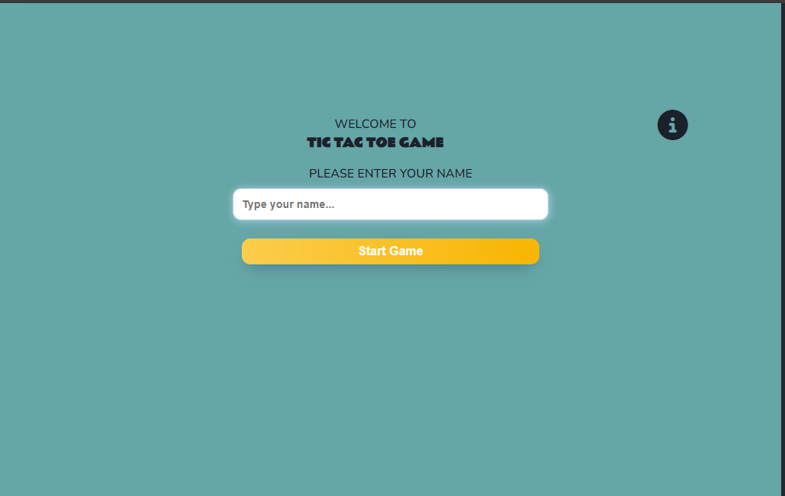

# Tic Tac Toe

Tic Tac Toe game website is classic fun meets modern convenience! This project aims to provide an engaging and accessible gaming experience for players of all ages. With its straightforward rules and quick matches, it's an ideal choice for casual gamers, families, and friends looking to challenge each other to a friendly competition.

Tic-tac-toe is a classic two-player game where players take turns marking spaces in a 3x3 grid with their respective symbols, aiming to be the first to form a horizontal, vertical, or diagonal line.

- - -
## Features 
### Existing Features
- __Favicon__
    - The favicon on our Tic Tac Toe game website looks like a small Tic Tac Toe board, making it easy to recognize and nice to look at. It helps people know it's our website and reminds them of the game they're about to play. It's small so it fits nicely in the tabs of your web browser and makes the website feel complete.

- __Login Screen__
	- In this section, users can type in their name to begin playing the game. The game won't start unless the user enters their name. If the user tries to start the game without entering their name, an error message will appear.
	- You can begin the game by clicking the "Start Game" button. Additionally, there's an information (i) icon available for viewing the game's instructions and rules.
    

 

- __Instruction Modal__
	- This section provides instructions and rules on how to play the game. If the user clicks on the "i" icon, a modal with instructions will appear. There is a close button to close this instruction modal. 
	- Instruction modal is available while playing the game.

- __Game Screen__
	- In this section, users can engage in the game, which features a 3x3 grid. The game involves two players, marked as X and O, taking turns. Additionally, users will find their username and user icon displayed in the top left corner.
	- User will find a "Reset Game" button that allows user to begin the new game.

- __Winner Message__
	- In this section, once the game is completed a message will be shown indicating the winner or declaring a draw.

- __Footer__
    - Within this section, users can access social media links and find copyright information.

### Features Left to Implements
- Implement a "Play Against Computer" feature.
- Adding difficulty levels feature.

- - -
## User Experience (UX)
### User Stories

#### **First Time Visitor Goals**
- **Learn the Game Easily:** Provide clear instructions on how to play tic-tac-toe and make the game interface easy to understand.
- **Device Responsiveness:** Design the game interface to work seamlessly across different devices, including desktops, tablets, and smartphones.
- **Intuitive Navigation:** Keep the interface clean and user-friendly, with easily accessible buttons for starting a game and accessing settings

#### **Returning Visitor Goals**
- **Keep it Simple:** Make sure returning players find the game just as easy to play as the first time.

#### **Frequent Visitor Goals:**
- **Keep it Fun:** Add new challenges to keep players interested and coming back for more.

- - -
## Design

## Wireframe
- The wireframe for the mobile version of the website was created using Figma. While the implemented version may not match the exact layout of the wireframe due to changes made during development, the initial design provided valuable insights and a starting point for the development process.

###### Login Screen Wireframe

###### Instruction Modal Wireframe

###### Game Screen Wireframe

###### Winner Message Wireframe

### Colour Scheme
The color scheme is created using [Coolors](https://coolors.co/). I've utilized #65A6A7 for the body background, #FCCD4D for buttons, #FFFFC7 for game board boxes, #CF2857 for instructional modals, and #C9A7B0 for user login error messages.

### Typography

Google Fonts was used to import the chosen fonts for use in the site.
Poppins font from Google fonts was used throughout the whole website with a fallback to sans-serif.
- - -
## Testing 

- HTML
    - No errors were returned when passing through the official [W3C validator](https://validator.w3.org/)

- CSS
    - No errors were found when passing through the official [(Jigsaw) validator](https://jigsaw.w3.org/css-validator/)

- JavaScript
    -  [Jshint validator](https://jshint.com/)
      - The following metrics were returned: 

### Bugs and Fixes:
- After I made the HTML file, I noticed this error in the console.

        - After adding `<link rel="shortcut icon" href="#">` in head element of HTML file, the error got removed.

- When validating with JShint, I came across some warnings regarding the use of the 'let' variable.

- After adding `/* jshint esversion: 6 */` in script.js file, warnings got resolved.
- I used <a href="https://stackoverflow.com/questions/61764048/i-cant-fix-the-let-warning-in-jshint-plugin-for-vscode-in-all-the-new-project" target="_blank"> for the solution.
    